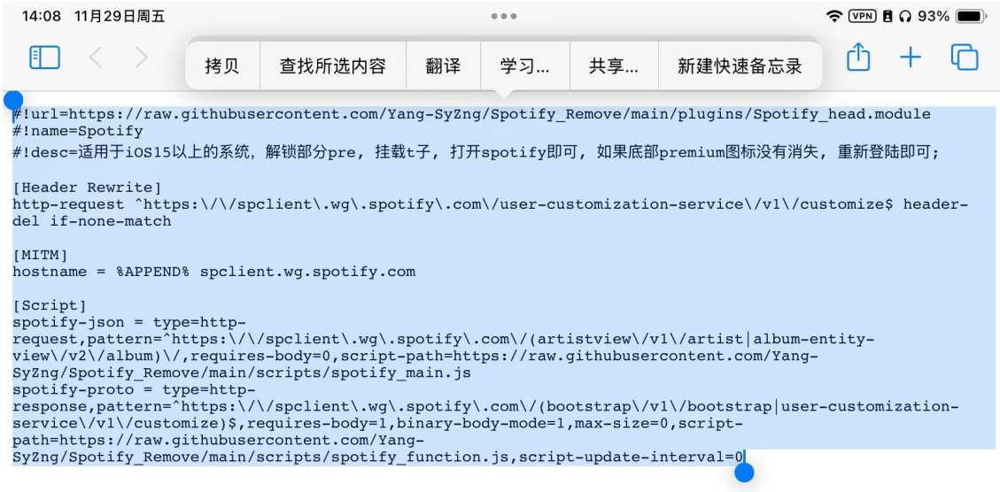

# iOS 端Spotify免费听歌办法 (教程)
# 注：本文所有的内容均来自互联网，修修补补，搭建的过程的展示能让更多的人少走弯路，无任何盈利，纯粹是为了使用更方便
> ***本文所需要的两个链接（长按可以复制）***
---
> 链接1：`https://raw.githubusercontent.com/Yang-SyZng/Spotify_Remove/refs/heads/main/plugins/Spotify_head.module`

> 链接2：`https://johnshall.github.io/Shadowrocket-ADBlock-Rules-Forever/lazy_group.conf`

> 链接3：`https://raw.githubusercontent.com/blackmatrix7/ios_rule_script/master/rule/Loon/Spotify/Spotify.list`

Forked from [@app2smile](https://github.com/app2smile)
## 模块安装方法：
## ！需要提前挂好梯子的环境！
## ！需要提前挂好梯子的环境！
## ！需要提前挂好梯子的环境！

### 1. 导入去Pre模块 - 前置任务 

点击底部“配置”页面的“模块”

**由于Shadowrocket版本的更新，模块界面左上角的“➕”，现在无法直接从GitHub上复制raw链接下载module，因此需要手动复制下载**

点击“新建模块”

会显示如下界面

**清除内容**

`#!name=Name Here`

`#!desc=Description Here`

---
### 2. 导入去Pre模块

> 链接1：`https://raw.githubusercontent.com/Yang-SyZng/Spotify_Remove/refs/heads/main/plugins/Spotify_head.module`

打开 Safari 浏览器或者其他其他浏览器中访问
全选复制

复制到小火箭当中，并保存

保存之后可能会自动下载模块了，并出现“成功”提示词

如果出现失败等字眼，点击圆圈圈起的位置，重新下载模块

反正以防万一尽量都点一下

这样就算导入好了模块文件

---

### 3. 配置文件 - 导入配置文件

回到配置界面， 点击右上角的“➕”号

 将链接复制到此处， 一样下载

> 链接2：`https://johnshall.github.io/Shadowrocket-ADBlock-Rules-Forever/lazy_group.conf`

出现 lazy-group.conf 就行， 长按他-点“使用配置”，让橙色点在  lazy-group.conf 那一行就行

---
> 这步有什么用？

> 一般来说维持 Pre 的状态，需要一直挂着梯子。那么出现的问题就是有些国内软件或网站加载速度很慢。那么这个配置文件在过程中起到关键作用， 国内默认直连， 国外走配置文件。

> *如果想要其他的配置文件可以上
@Johnshall维护的
[Shadowrocket-ADBlock-Rules-Forever](https://github.com/Johnshall/Shadowrocket-ADBlock-Rules-Forever)查看下载*

---

### 4. 配置文件 - 安装证书

点击✔旁边的“i

点击“HTTPS 解密”

打开“HTTPS 解密”

这个时候会弹出证书， 点击“生成新的 CA 证书”， 然后还会再弹出一个小窗， 再次点击“生成新的 CA 证书”

然后就会变成如下的样子， 点击“安装证书”

允许即可

退出小火箭打开系统设置， 顶部就会有个“已下载描述文件”， 或者设置-通用-VPN 与设备管理， 有“已下载的描述文件”

点击描述文件进去， 右上角会有个“安装”， 安装即可， 完成后就是如下

再次点开系统设置 - 通用 - 关于本机 - 划到底找到证书信任设置

开关打开即可

返回小火箭， 直到出现“系统已信任”， 即可

---

### 4. 配置文件 - 添加Spotify规则 （可能需要）

点击✔旁边的“i

**搜索“spotify”， 如果有的话可以直接跳过此步骤**

**搜索“spotify”， 如果有的话可以直接跳过此步骤**

**搜索“spotify”， 如果有的话可以直接跳过此步骤**

**如果没有**， 点击规则

点击右上角的“➕”

将链接复制进“域名”中，其他默认选项，点击保存

> 链接3：`https://raw.githubusercontent.com/blackmatrix7/ios_rule_script/master/rule/Loon/Spotify/Spotify.list`

完成后返回即可

### <u>**这里， 基本上小火箭都操作完了， 接下来打开 Spotify**</u>

